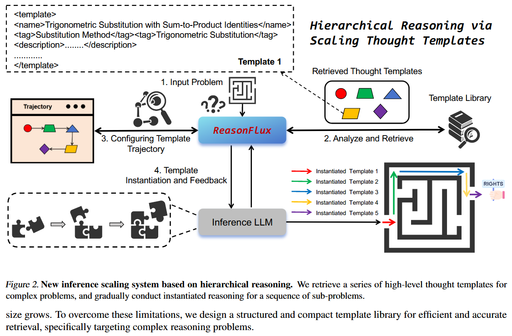
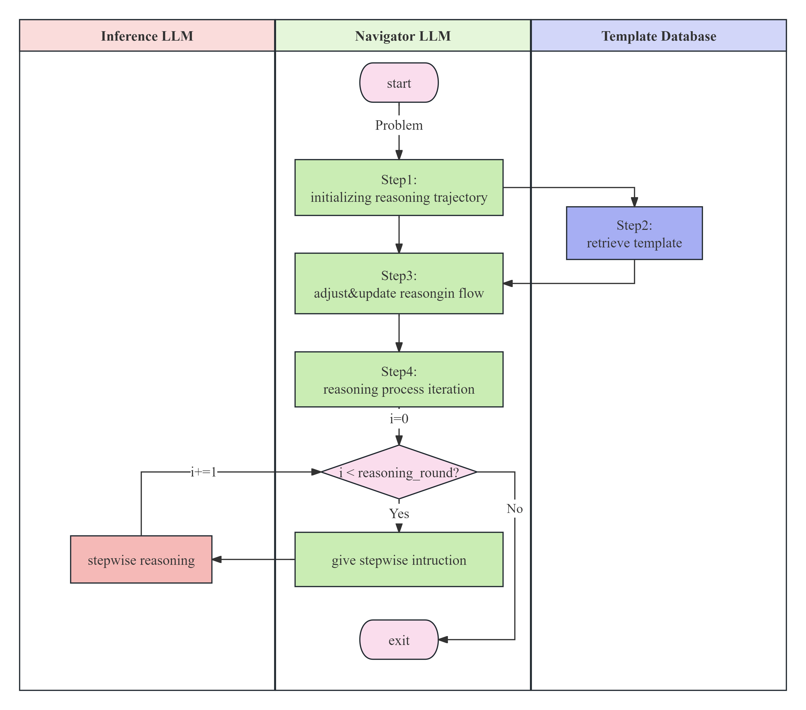

# ReasonFlux-Refined: Hierarchical LLM Reasoning via Scaling Thought Templates
<center>
<a href="./README_ZH.md">中文</a> |
<a href="./README.md">English</a>
</center>

`ReasonFlux-Refined` is an improved version of [ReasonFlux](https://github.com/Gen-Verse/ReasonFlux/tree/main), utilizing the `langchain SDK` and `chromadb` to build a more robust hierarchical reasoning system. The specific improvements include:

+ Nearly a `100%` logic replication of the original reasoning system, with a clearer framework design.

+ Full support for LLM calls in `OpenAI` format.

+ Leveraging the interfaces provided by `chromadb`, a hierarchical vector database has been designed to achieve persistent storage and hierarchical retrieval of template vectors.

+ Easy configuration of agent and database settings through `pydantic_yaml`.

The original paper's framework diagram is as follows:


Following the code logic of the paper and the original repo, the framework design of this repository can be represented by a swimlane diagram:


The ReasonFlux-Refined framework consists of three main components (`INT`):

+ `Inference LLM`: The reasoning agent responsible for accepting guidance from the `Navigator` and step-by-step reasoning to derive the answer to the problem.

+ `Navigator`: The navigation agent responsible for retrieving templates based on the problem and optimizing the reasoning flow (`Reasoning Flow`) to provide step-by-step guidance for the Inference LLM to solve the problem.

+ `Template Database`: A hierarchical template vector database responsible for hierarchical, persistent storage, and retrieval of templates.

For a given (mathematical) problem, the operation process of `ReasonFlux-Refined` is as follows:

+ **Step1-Template Initialization**: The `Navigator` generates an initial template in the required format based on its own knowledge.

+ **Step2-Template Retrieval**: The initial template generated by the `Navigator` is compared with the templates in the `Template Database` through hierarchical similarity search, returning the most similar template from the template library.

+ **Step3-Reasoning Flow Optimization**: The `Navigator` optimizes the reasoning flow based on the retrieved template and the input problem.

+ **Step4-Reasoning**: According to the reasoning flow, the `Navigator` guides the `Inference` step-by-step to complete the problem-solving process.

## Quick Start
1. **Create Environment and Install Dependencies**
    ```bash
    conda create -n ReasonFlux-Refined python=3.12.9
    conda activate ReasonFlux-Refined
    pip install -r requirements.txt
    ```

2. **Configure Hierarchical Vector Database**: In the original code repository, the template format in `data/template_library.json` is as follows:
    ```json
    {
        "Chapter1": {
            "Section1": [
                template1,
                template2,
                ...
            ],
            "Section2": [
                template1,
                template2,
                ...
            ],
            ...
        },
        "Chapter2": ...
    }
    ```
    Embedding and mapping these templates into a dictionary every time the code runs is time-consuming.
    To address this and achieve persistent storage, first run the script:

    ```bash
    python scripts/format_template.py
    ```

    This script reads `data/template_library.json` and transforms the templates into a "strict" nested dictionary format for hierarchical database storage:
    ```json
    {
        "Chapter1": {
            "Section1": {
                "template1": "template1_repr",
                "template2": "template2_repr",
                ...
            },
            "Section2": {
                "template1": "template1_repr",
                "template2": "template2_repr",
                ...
            }
        },
        "Chapter2": {
            "Section1": {
                "template1": "template1_repr",
                "template2": "template2_repr",
                ...
            },
            "Section2": {
                "template1": "template1_repr",
                "template2": "template2_repr",
                ...
            }
        }
    }
    ```
    The transformed result can be seen in `data/template_library.json`.
    Then configure the database storage path and embedding service information in `ReasonFlux/config/database/database.yaml`, and run the script:
    ```bash
    python scripts/create_hierarchical_database.py --database_config ReasonFlux/config/database/database.yaml --template_file data/format_library.json
    ```

    This will build a hierarchical template vector database with persistent storage in the specified data folder.

3. **Run ReasonFlux**: Configure the properties of the two agents in `ReasonFlux/config/agent `and the database properties in `ReasonFlux/config/database`. If you want to run a local language or embedding model, it is recommended to use [vllm](https://github.com/vllm-project/vllm) or [Xinference](https://github.com/Nymbo/xinference) for deployment and forwarding to the corresponding port. Then run the script `tests/test_reason_flux.py`:
    ```python
    import sys, os
    import json
    sys.path.append(os.getcwd())
    from ReasonFlux.reason_flux import ReasonFlux

    def test_reason_flux():
        problem = r"Given a sequence {aₙ} satisfying a₁=3, and aₙ₊₁=2aₙ+5 (n≥1), find the general term formula aₙ"
        reason_flux = ReasonFlux(
            inference_config_path="ReasonFlux/config/agent/inference.yaml",
            navigator_config_path="ReasonFlux/config/agent/navigator.yaml",
            hierarchical_database_config_path="ReasonFlux/config/database/database.yaml"
        )

        meta_data = reason_flux.run(problem)
        if meta_data:
            with open("ReasonFlux/output/meta_data.json", "w") as f:
                json.dump(meta_data, f, indent=4)

    if __name__ == "__main__":
        test_reason_flux()
    ```

    Bash command:
    ```bash
    # if you choose to run in the background
    nohup python tests/test_reason_flux.py > output/test.log 2>&1 &
    ```

    The output in [output/test.log](./output/test.log) will be as follows:
    ```log
    nohup: ignoring input
    2025-03-26 19:59:19,394 - ReasonFlux - INFO - Starting ReasonFlux with problem: 
    Given a sequence {aₙ} satisfying a₁=3, and aₙ₊₁=2aₙ+5 (n≥1), find the general term formula aₙ

    2025-03-26 19:59:19,394 - ReasonFlux - INFO - [Step1] Navigator initialize the reasoning trajectory
    2025-03-26 19:59:33,917 - ReasonFlux - INFO - [Step1] Navigator's reasoning thoughts: 
    ['The problem is asking for the general term of a sequence {aₙ} defined by the initial condition and a recursive relation. This is a typical problem in sequences and series, more specifically, it involves solving linear recurrence relations. The method to solve such problems is generally to find a pattern or transform the given relation into a simpler form, often through the characteristic equation. The knowledge points involved include understanding of sequences, especially recursive sequences, and how to handle linear recurrence relations.']
    ...
    ```

    In the output folder, we have already provided an [example](./output/meta_data.json) result using `qwen-max`.

## Limitations
The reasoning process is relatively slow and highly dependent on model performance.

## Future Plans
1. Optimize the prompts to enhance the performance of the agents.
2. Improve the evaluation logic and scripts, and attempt to reproduce the paper's results on datasets such as `math-500`.
3. Experiment with the latest models released by [ReasonFlux](https://github.com/Gen-Verse/ReasonFlux).

## Citation
```bibtex
@article{yang2025reasonflux,
  title={ReasonFlux: Hierarchical LLM Reasoning via Scaling Thought Templates},
  author={Yang, Ling and Yu, Zhaochen and Cui, Bin and Wang, Mengdi},
  journal={arXiv preprint arXiv:2502.06772},
  year={2025}
}
```