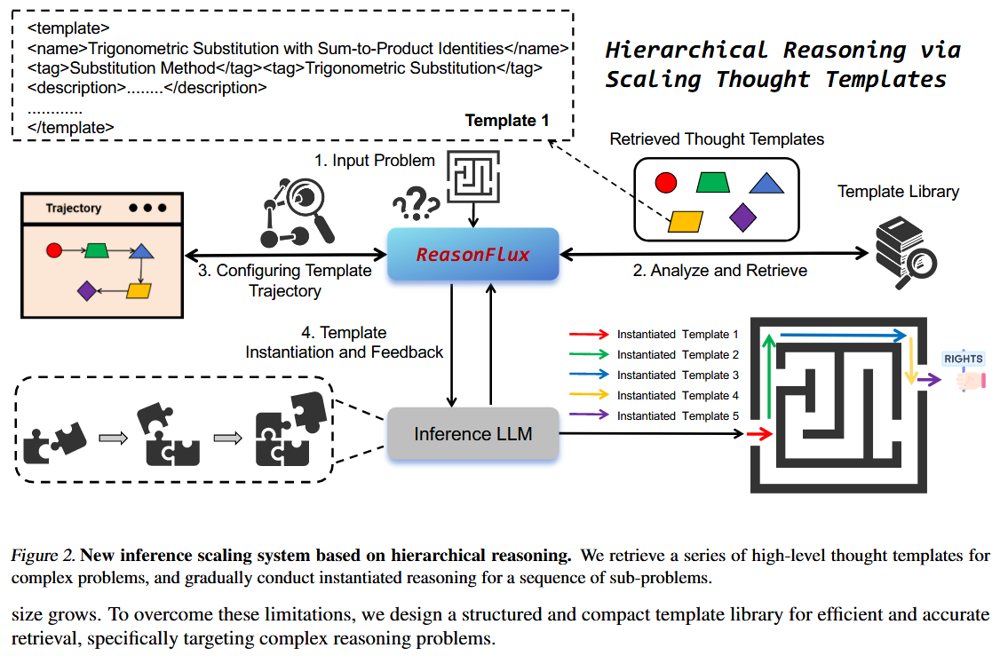
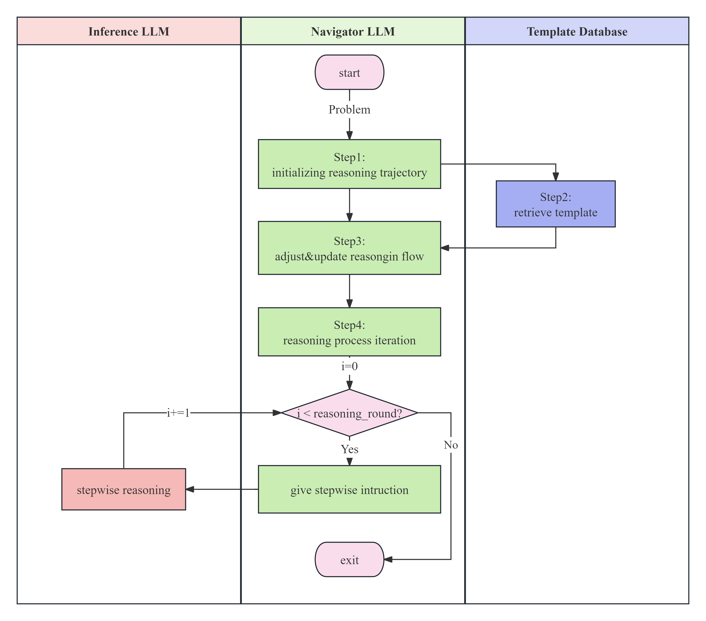

# ReasonFlux-Refined: Hierarchical LLM Reasoning via Scaling Thought Templates

ReasonFlux-Refined 基于[ReasonFlux](https://github.com/Gen-Verse/ReasonFlux/tree/main)进行了改进，利用`langchain SDK`和`chromadb`构建了更加健壮的层次化推理系统，具体改进点为：

+ 接近`100%`逻辑复刻原推理系统，框架设计更加清晰
+ 全面支持`OpenAI`格式的LLM调用
+ 利用`chromadb`提供的接口，设计了分层向量数据库，完成了模板向量的持久化存储与分层检索
+ 通过`pydantic_yaml`轻松配置agent及database设置


原论文框架示意图为：


遵从论文及原仓库的代码逻辑设计，本仓库的框架设计可以以泳道图表示：


`ReasonFlux-Refined`框架主要由三个部分（`INT`）组成：
+ `Inference LLM`：推理Agent，负责接受来自`Navigator`的指导，并一步步推理出问题的答案。
+ `Navigator`：导航Agent，负责根据问题检索模板及优化推理流`Reason Flow`，为`Inference LLM`解题提供步骤级别的指导。
+ `Template Database`：分层模板向量数据库，负责分层化、持久化存储和检索模板。

对于给定的（数学）问题，`ReasonFlux-Refined`会按照如下流程运作：
+ Step1-模板初始化：`Navigator`基于自身知识，根据问题给出符合要求格式的初始模板。
+ Step2-模板检索：将`Navigator`生成的初始模板与`Template Database`中的模板进行**分层**相似度检索，返回模板库中与初始模板最相似的模板。
+ Step3-推理流程优化：`Navigator`根据检索到的模板，结合输入问题，对推理流程进行优化。
+ Step4-推理：依据推理流，`Navigator`一步步指导`Inference`完成解题过程。

# Quick Start

1. 创建环境及安装依赖包
    ```bash
    conda create -n ReasonFlux-Refined python=3.12.9
    conda activate ReasonFlux-Refined
    pip install -r requirements.txt
    ```

2. 配置分层向量数据库：在原代码仓库中`data/template_library.json`下，template的格式示例如下：
    ```json
    {
        "Chapter1": {
            "Section1": [
                template1,
                template2,
                ...
            ],
            "Section2": [
                template1,
                template2,
                ...
            ],
            ...
        },
        "Chapter2": ...
    }
    ```
    并且每次运行代码都要重新进行嵌入、映射到字典里，比较消耗实践。

    为了解决这一问题并进行持久化存储，请首先运行脚本：
    ```bash
    python scripts/format_template.py
    ```
    该脚本会读取`data/template_library.json`，将其中的模板转化为如下格式（一个“严格”的嵌套字典）， 以方便分层数据库进行存储：
    ```json
    {
        "Chapter1": {
            "Section1": {
                "template1": "template1_repr",
                "template2": "template2_repr",
                ...
            },
            "Section2": {
                "template1": "template1_repr",
                "template2": "template2_repr",
                ...
            }
        },
        "Chapter1": {
            "Section1": {
                "template1": "template1_repr",
                "template2": "template2_repr",
                ...
            },
            "Section2": {
                "template1": "template1_repr",
                "template2": "template2_repr",
                ...
            }
        }
    }
    ```
    在`data/template_library.json`下可以看到转化结果。

    然后在`ReasonFlux/config/database/database.yaml`下配置数据库存储路径和`embedding`服务信息，运行脚本：
    ```bash
    python scripts/create_hierarchical_database.py --database_config ReasonFlux/config/database/database.yaml --template_file data/format_library.json
    ```
    即可在指定的数据文件夹下构建持久化存储的分层模板向量数据库。

3. 运行`ReasonFlux`。在`ReasonFlux/config/agent`下进行两个agent属性的配置，在`ReasonFlux/config/database`下进行数据库属性的配置。如果你想运行本地语言或者嵌入模型，推荐使用[vllm](https://github.com/vllm-project/vllm)或[Xinference](https://github.com/Nymbo/xinference)进行部署并转发至相应端口。然后运行脚本`tests/test_reason_flux.py`:
```python
import sys,os
import json
sys.path.append(os.getcwd())
from ReasonFlux.reason_flux import ReasonFlux

def test_reason_flux():
    problem = r"Given a sequence {aₙ} satisfying a₁=3, and aₙ₊₁=2aₙ+5 (n≥1), find the general term formula aₙ"
    reason_flux = ReasonFlux(
        inference_config_path="ReasonFlux/config/agent/inference.yaml",
        navigator_config_path="ReasonFlux/config/agent/navigator.yaml",
        hierarchical_database_config_path="ReasonFlux/config/database/database.yaml"
    )

    meta_data = reason_flux.run(problem)
    if meta_data:
        with open("ReasonFlux/output/meta_data.json", "w") as f:
            json.dump(meta_data, f, indent=4)

if __name__ == "__main__":
    test_reason_flux()
```

bash命令：
```bash
# if you choose to run in the background
nohup python tests/test_reason_flux.py > output/test.log 2>&1 &
```

然后会在`output/test.log`得到如下输出：
```log
nohup: ignoring input
2025-03-26 19:59:19,394 - ReasonFlux - INFO - Starting ReasonFlux with problem: 
Given a sequence {aₙ} satisfying a₁=3, and aₙ₊₁=2aₙ+5 (n≥1), find the general term formula aₙ

2025-03-26 19:59:19,394 - ReasonFlux - INFO - [Step1] Navigator initialize the reasoning trajectory
2025-03-26 19:59:33,917 - ReasonFlux - INFO - [Step1] Navigator's reasoning thoughts: 
['The problem is asking for the general term of a sequence {aₙ} defined by the initial condition and a recursive relation. This is a typical problem in sequences and series, more specifically, it involves solving linear recurrence relations. The method to solve such problems is generally to find a pattern or transform the given relation into a simpler form, often through the characteristic equation. The knowledge points involved include understanding of sequences, especially recursive sequences, and how to handle linear recurrence relations.']
...
```

在`output`文件夹下，我们已经给出了使用`qwen-max`运行的一个结果示例。

# 局限性
推理流程较慢，极度依赖模型性能。

# 未来计划
1. 优化相关prompt，提升agent的性能表现。
2. 完善评测逻辑及脚本，在诸如`math-500`等数据集上尝试复现论文效果。
3. 尝试[ReasonFlux](https://github.com/Gen-Verse/ReasonFlux)最新发布的模型。

# 引用
```
@article{yang2025reasonflux,
  title={ReasonFlux: Hierarchical LLM Reasoning via Scaling Thought Templates},
  author={Yang, Ling and Yu, Zhaochen and Cui, Bin and Wang, Mengdi},
  journal={arXiv preprint arXiv:2502.06772},
  year={2025}
}
```