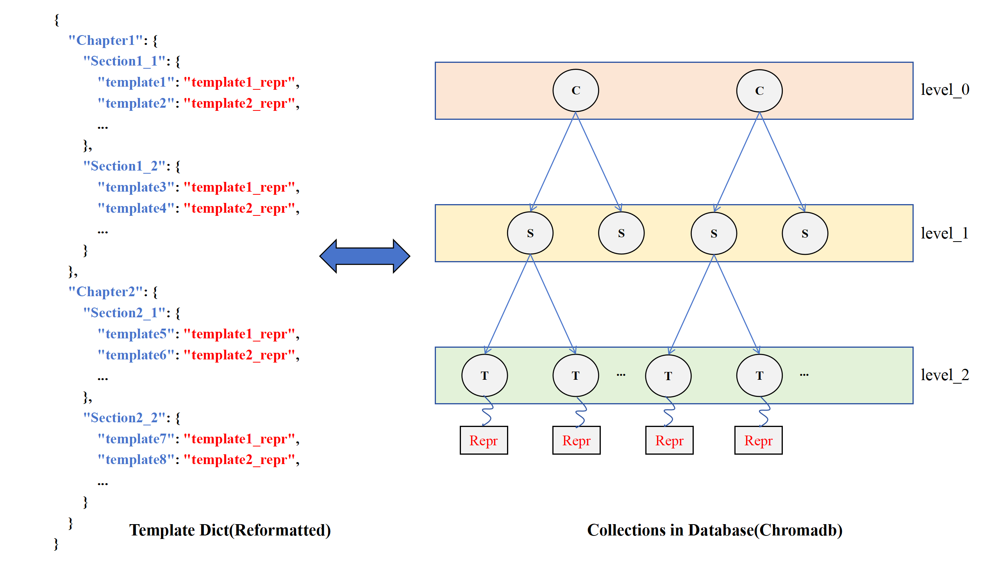

# Hierarchical Vector Database
<center>
<a href="./README_ZH.md">中文</a> |
<a href="./README.md">English</a>
</center>
In this directory, we have implemented a hierarchical vector database based on `chromadb`. This database can store nested dictionaries in a hierarchical manner and supports hierarchical retrieval.


As shown in the figure, the database consists of several data collections, each of which stores data nodes at the same level. The structure of each node is as follows:

```json
{
    "doc": "The key of the node",
    "id": "The UUID of the node",
    "embedding": "The embedding vector of the node",
    "metadata": {
        "parent": "The ID of the parent node (the parent node is in the upper-level collection)",
        "depth": "The level to which the node belongs",
        "data": "If it is a leaf node, it contains the corresponding data; otherwise, it is empty"
    }
}
```

We traverse the nested dictionary using a depth-first search (DFS) approach and store it in the corresponding level. For the implementation, please refer to `ReasonFlux/template_matcher/database.py/HierarchicalVectorDatabase.add_recursive_dict`.

During traversal, we follow the idea of the original paper/repository and perform a beam search-like search. Given a hierarchical query $Q=[q_1,q_2,q_3,...]$, the number of candidate nodes at each level $N=[n_1,n_2,n_3,...]$,  the cosine similarity weights at each level $W=[w_1,w_2,w_3,...]$, and the final number of results to return `M`，the search process is as follows:

```
input: Q, N, W, M

cand = []
parents = []
collections = [C1, C2, C3, ...]
for i in search_depth:
    if cand:
        parents = get_ids(cand)
    cand = Ci.similarity_search(cand, Q[i], condition=parents)
    cand.score = cand.similarity * W[i] + cand.parent.score

return max(cand, key=lambda x: x.score)[:M]
```

For the implementation, please refer to `ReasonFlux/template_matcher/database.py/HierarchicalVectorDatabase.hierarchical_search`.