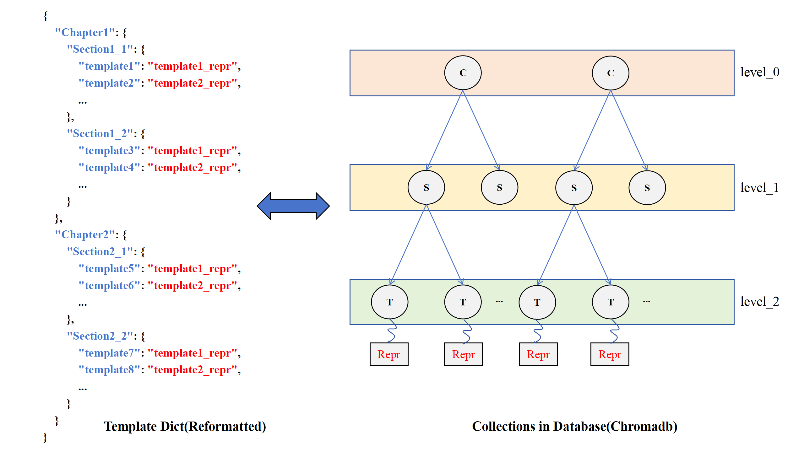

# Hierarchical Vector Database

在本目录中，我们基于`chromadb`实现了一个分层向量数据库，该数据库可以将结构嵌套的字典按层次存储到数据库中，并且可以进行分层检索。



如图所示，数据库由若干数据集合`collection`组成，每个`collection`都只存储同一层级的数据节点。每个节点的构成如下：
```json
{
    "doc": "节点的键",
    "id": "节点的uuid",
    "embedding": "节点的嵌入向量",
    "metadata": {
        "parent": "节点的父节点id（父节点位于上一层collection中）",
        "depth": "节点所属层级",
        "data": "若为叶子节点，则为其对应数据，否则为空"
    }
}
```

我们采取深度优先搜索(DFS)的方式遍历嵌套字典，并将其存储到对应层级中。实现代码请参阅`ReasonFlux/template_matcher/database.py/HierarchicalVectorDatabase.add_recursive_dict`。

遍历时，我们遵从原论文/代码仓库的思想，进行类`beam search`搜索。给定分层查询$Q=[q_1,q_2,q_3,...]$，每层候选节点数量$N=[n_1,n_2,n_3,...]$，每层（余弦）相似度权重$W=[w_1,w_2,w_3,...]$，及最终返回结果数量`M`，进行如下搜索：
```
input: Q, N, W, M

cand = []
parents = []
collections = [C1, C2, C3, ...]
for i in search_depth:
    if cand:
        parents = get_ids(cand)
    cand = Ci.similarity_search(cand, Q[i], condition=parents)
    cand.score = cand.similarity * W[i] + cand.parent.score

return max(cand, key=lambda x: x.score)[:M]
```

实现代码请参阅：`ReasonFlux/template_matcher/database.py/HierarchicalVectorDatabase.hierarchical_search`。